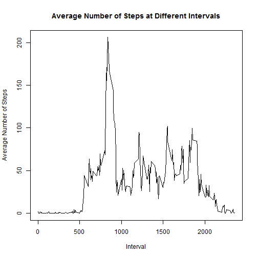

Load the data 


```r
actdat <- read.csv("activity.csv", stringsAsFactors=FALSE, header=TRUE)
str(actdat)
```

```
## 'data.frame':	17568 obs. of  3 variables:
##  $ steps   : int  NA NA NA NA NA NA NA NA NA NA ...
##  $ date    : chr  "2012-10-01" "2012-10-01" "2012-10-01" "2012-10-01" ...
##  $ interval: int  0 5 10 15 20 25 30 35 40 45 ...
```

```r
dat<-actdat[,c(2,1,3)]
str(dat)
```

```
## 'data.frame':	17568 obs. of  3 variables:
##  $ date    : chr  "2012-10-01" "2012-10-01" "2012-10-01" "2012-10-01" ...
##  $ steps   : int  NA NA NA NA NA NA NA NA NA NA ...
##  $ interval: int  0 5 10 15 20 25 30 35 40 45 ...
```

1. What is mean total number of steps taken per day?


```r
dat1<-subset(dat,select=date:steps)
str(dat1)
```

```
## 'data.frame':	17568 obs. of  2 variables:
##  $ date : chr  "2012-10-01" "2012-10-01" "2012-10-01" "2012-10-01" ...
##  $ steps: int  NA NA NA NA NA NA NA NA NA NA ...
```

```r
dat2<-aggregate(. ~ date, data=dat1, FUN=sum)
```


```r
#create a histogram
hist(dat2$steps, main ="Histogram of Total Steps per Day", xlab="Total Steps per Day", ylim=c(0,40))
```

 

```r
avg<-mean(dat2$steps,rm.na=TRUE)
avg
```

```
## [1] 10766.19
```

```r
med1<-median(dat2$steps)
med1
```

```
## [1] 10765
```

The mean of the total number of steps taken per day is 1.0766189 &times; 10<sup>4</sup>, and the median of the total number of steps taken per day is 10765.

2. What is the average daily activity pattern?


```r
dailydat1<-subset(dat, select=interval:steps)
str(dailydat1)
```

```
## 'data.frame':	17568 obs. of  2 variables:
##  $ interval: int  0 5 10 15 20 25 30 35 40 45 ...
##  $ steps   : int  NA NA NA NA NA NA NA NA NA NA ...
```

```r
dailydat2<-aggregate(steps ~ interval, data=dailydat1, FUN=mean)
str(dailydat2)
```

```
## 'data.frame':	288 obs. of  2 variables:
##  $ interval: int  0 5 10 15 20 25 30 35 40 45 ...
##  $ steps   : num  1.717 0.3396 0.1321 0.1509 0.0755 ...
```


```r
plot(dailydat2, type='l', main="Average Number of Steps at Different Intervals", xlab="Interval", ylab="Average Number of Steps")
```

 

```r
max_index<-which.max(dailydat2$steps)
max_index
```

```
## [1] 104
```

```r
interval_at_maxSteps<-dailydat2$interval[max_index]
interval_at_maxSteps
```

```
## [1] 835
```

At Interval of 835 contains the maximum number of steps.

3. Imputing missing values


```r
num_missing<-sum(!complete.cases(actdat))
num_missing
```

```
## [1] 2304
```

```r
missing_data<-actdat[!complete.cases(actdat), ]
```

There are 2304 records of missing data in the original dataset

Strategy to fill in all the missing values in "steps": using mean of steps at that interval to fill the NA field regardless which day the value of steps is missing.


```r
dailydat2<-aggregate(. ~ interval, data=dailydat1, FUN=mean)
nrow(actdat)
```

```
## [1] 17568
```

```r
replaceMissing <- numeric()
  for (i in 1:nrow(actdat)) {
      actrow <- actdat[i, ]
      if (is.na(actrow$steps)) {
          steps <- subset(dailydat2, interval == actrow$interval)$steps
      } else {
          steps <- actrow$steps
      }
      replaceMissing <- c(replaceMissing, steps)
  }

#make a copy of the original data,actdat
filledActdat<-actdat
#create a new dataset with missing data filled in
filledActdat$steps<-replaceMissing
unique(is.na(filledActdat$steps))
```

```
## [1] FALSE
```

```r
filleddat<-filledActdat[,c(2,1,3)]
filleddat2<-aggregate(steps~ date, data=filleddat, FUN=sum)
```


```r
#create a histogram of the data with missing data filled in
hist(filleddat2$steps,main ="Histogram of Total Steps per Day (missing data filled)", xlab="Total Steps per Day", ylim=c(0,40) )
```

 

```r
avg_filled<-mean(filleddat2$steps)
avg_filled
```

```
## [1] 10766.19
```

```r
med1_filled<-median(filleddat2$steps)
med1_filled
```

```
## [1] 10766.19
```

After the missing data is filled in, 
the mean of total number of steps taken per day is 1.0766189 &times; 10<sup>4</sup>;
the median total number of steps taken per day is 1.0766189 &times; 10<sup>4</sup>;
The mean values with and without missing data is the same;
The median value with missing data filled is slightly higher than that with missing values.

The impact of imputing missing data results in a higher frequency for the bin of the interval range of 10000-15000.  

4. Are there differences in activity patterns between weekdays and weekends?


```r
#make a copy of the original data for weekday and weekend activity comparision
dayactdat<-actdat
dayactdat$date<-as.Date(dayactdat$date,"%Y-%m-%d")
str(dayactdat)
```

```
## 'data.frame':	17568 obs. of  3 variables:
##  $ steps   : int  NA NA NA NA NA NA NA NA NA NA ...
##  $ date    : Date, format: "2012-10-01" "2012-10-01" ...
##  $ interval: int  0 5 10 15 20 25 30 35 40 45 ...
```

```r
#identify day of week for each record and further determine if it is a weekday or a weekend, then append these two identifiers, "weekday" and "weekend" to the data
dayofweek<-weekdays(dayactdat$date, abbr = TRUE)
daytype <- vector()
for (i in 1:nrow(filledActdat)) {
    if (dayofweek[i] == "Sat" | dayofweek[i]=="Sun") {
        daytype[i] <- "Weekend"
    }  else {
        daytype[i] <- "Weekday"
    }
}

filleddaytypeActdat<-cbind(filledActdat,daytype)
# calculate the mean for each interval for weekay data an weekend data
library(lattice)
filleddaytypeActdat2<-aggregate(steps ~ interval + daytype, data=filleddaytypeActdat, FUN=mean)
```


```r
xyplot(steps ~ interval | daytype, filleddaytypeActdat2, type = "l", layout = c(1, 2), xlab = "Interval", ylab = "Steps", ylim=c(-5,250))
```

 


There are different patterns in weekday daily activities and weekend daily activities.  On weekdays, people are most active around interval 835.  On weekends, people are active in a wider window of time, but less intense around interval 835, where is the max steps taken occur.
